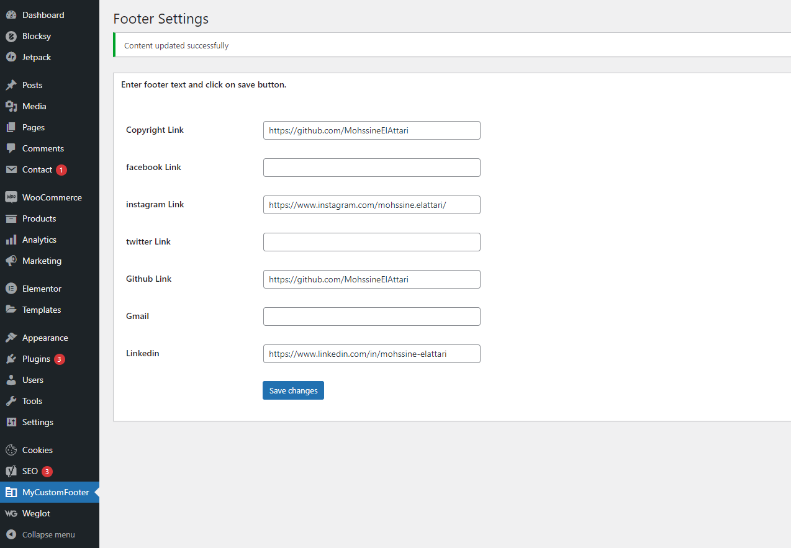

# Creating Plugin Wordpress

<h2>Contexte du projet</h2>

vous êtes amenés à créer un plugin qui a pour but de personnaliser le footer de vos pages :

-Créer le plugin

-Activer votre plugin

-Créer un menu pour le plugin qui va s'afficher dans la partie back-end de WordPress

-Personnaliser l'icône du plugin

-sécuriser l'accès directe à votre fichiers php du plugin(bloquer l'accès directe)

-le plugin personnaliser le footer de vos page (ex: Ajouter le copyright et/ou les liens de vos réseau sociaux, et/ou vos coordonnées ....).

Réutiliser votre plugin dans votre site e-commerce (le brief précédent)

